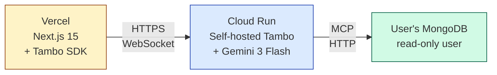
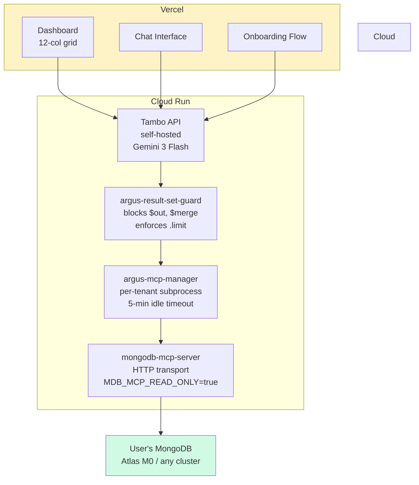

# X15 — Architecture Diagram Spec

**Audit finding:** No architecture diagram. README is the first thing judges read. A picture is the highest-ROI asset.

**User request:** "X15 will be there, just listed."

**This document is the spec for the architecture diagram that goes in the README, in `ARCHITECTURE.md`, and in the Devpost form. The diagram should be created with Excalidraw, Mermaid, or Figma — anything that produces a clean PNG/SVG.**

---

## The Diagram in One Sentence

**Argus is a 3-tier system: Vercel frontend, Cloud Run backend, and the user's MongoDB — connected by MCP over localhost.**

---

## The 3-Box Version (recommended for README H1)

The simplest possible diagram. Three boxes. Three arrows. One image.

```
┌──────────────┐         ┌──────────────┐         ┌──────────────┐
│              │   SSE   │              │   MCP   │              │
│   Vercel     ├────────▶│  Cloud Run   ├────────▶│   MongoDB    │
│  (Next.js)   │  HTTPS  │   (Tambo +   │  HTTP   │   (user's    │
│              │◀────────┤   Gemini)    │◀────────┤   cluster)   │
└──────────────┘         └──────────────┘         └──────────────┘
```

**Why this is the right opening image:**
- Judges can parse it in 2 seconds.
- It shows the 3 tiers (frontend, backend, data).
- It shows the two protocols (HTTPS for frontend↔backend, MCP over HTTP for backend↔MongoDB).
- It anchors the "self-hosted" claim (Tambo on Cloud Run, not Tambo Cloud).
- It anchors the "user's MongoDB" claim (the data is the user's, not ours).

---

## The 5-Component Version (recommended for ARCHITECTURE.md)

Slightly more detail. Shows the internal structure of the Cloud Run backend.

```
┌─────────────────────────────────────────────────────────────────────┐
│                          VERCEL (Frontend)                          │
│                                                                     │
│   Next.js 15 + Tambo React SDK                                     │
│   ┌────────────┐ ┌────────────┐ ┌────────────┐                    │
│   │ Dashboard  │ │ Chat       │ │ Onboarding │                    │
│   │ (12-col    │ │ Interface  │ │ Flow       │                    │
│   │ grid)      │ │            │ │            │                    │
│   └────────────┘ └────────────┘ └────────────┘                    │
│                                                                     │
└────────────────────────┬────────────────────────────────────────────┘
                         │ HTTPS + WebSocket
                         │ (session token in header)
                         ▼
┌─────────────────────────────────────────────────────────────────────┐
│                       CLOUD RUN (Backend)                           │
│                                                                     │
│   ┌───────────────────────────────────────────────────────────┐    │
│   │  Tambo API Server (self-hosted, Docker)                   │    │
│   │  • LLM: Gemini 3 Flash                                   │    │
│   │  • Component registry: 7 Zod-typed cards                 │    │
│   │  • Conversation state: Memorystore (Redis)               │    │
│   └───────────────────────────────────────────────────────────┘    │
│                            │                                        │
│                            │ MCP (HTTP)                             │
│                            ▼                                        │
│   ┌───────────────────────────────────────────────────────────┐    │
│   │  argus-result-set-guard (Python middleware)              │    │
│   │  • Blocks $out, $merge at planner layer                  │    │
│   │  • Enforces .limit() on every find/aggregate             │    │
│   │  • Redacts PII in card data                              │    │
│   │  • Strips connection strings from logs                   │    │
│   └───────────────────────────────────────────────────────────┘    │
│                            │                                        │
│                            │ MCP (HTTP)                             │
│                            ▼                                        │
│   ┌───────────────────────────────────────────────────────────┐    │
│   │  argus-mcp-manager (Python)                              │    │
│   │  • Per-tenant mongodb-mcp-server subprocess              │    │
│   │  • Lazy respawn on each API call if PID is dead          │    │
│   │  • 5-min idle timeout                                    │    │
│   │  • Max 10 concurrent subprocesses per instance           │    │
│   └───────────────────────────────────────────────────────────┘    │
│                            │                                        │
│                            │ MongoDB wire protocol                  │
│                            ▼                                        │
│   ┌───────────────────────────────────────────────────────────┐    │
│   │  mongodb-mcp-server (HTTP transport, sidecar)            │    │
│   │  • 26 database tools + 19 Atlas tools                    │    │
│   │  • MDB_MCP_READ_ONLY=true                                │    │
│   │  • Listens on 127.0.0.1:3000                            │    │
│   └───────────────────────────────────────────────────────────┘    │
│                                                                     │
└────────────────────────┬────────────────────────────────────────────┘
                         │ MongoDB wire protocol
                         │ (user's connection string)
                         ▼
┌─────────────────────────────────────────────────────────────────────┐
│                   USER'S MONGODB ATLAS CLUSTER                      │
│                                                                     │
│   (M0 free tier, or any other cluster with read-only user)         │
└─────────────────────────────────────────────────────────────────────┘
```

**Why this is the right detail level for ARCHITECTURE.md:**
- Shows the 4 internal components of the backend (Tambo, result_set_guard, mcp_manager, mongodb-mcp-server).
- Shows the data flow (frontend → Tambo → result_set_guard → mcp_manager → mongodb-mcp-server → MongoDB).
- Shows the two MCP segments (frontend-Tambo is via Tambo's MCP, backend-MongoDB is via mongodb-mcp-server).
- Documents the read-only enforcement (3 layers: result_set_guard, mongodb-mcp-server's `--readOnly`, recommended read-only user).

---

## The Data Flow Version (recommended for the 3-min video)

Animated version of the 3-box diagram, showing one request end-to-end. This is what the video should show at 0:30.

**Frame 1 (0:30 in video):** User types "show me the count of users by country."

**Frame 2 (0:31):** Vercel sends the request to Cloud Run with a session token.

**Frame 3 (0:32):** Tambo (on Cloud Run) receives the request. It asks Gemini: "given this user message, which card should I render?" Gemini says: "StatCard with country breakdown."

**Frame 4 (0:34):** Tambo calls the `mongodb_aggregate` tool on the result_set_guard, which validates the pipeline (no $out, no $merge, has .limit()), then forwards to the mcp_manager.

**Frame 5 (0:35):** The mcp_manager looks up the tenant's subprocess, calls `mongodb_aggregate` on mongodb-mcp-server, which queries the user's MongoDB.

**Frame 6 (0:36):** The result flows back: MongoDB → mongodb-mcp-server → mcp_manager → result_set_guard → Tambo → Vercel → user.

**Frame 7 (0:38):** The StatCard renders with the data.

**Total elapsed time: 8 seconds.** This is what the video should show. A real-time data flow with each step labeled.

---

## What to NOT include in the diagram

- **Cloud Observability traces.** It's free tech points but it's noise in a 3-box diagram.
- **Memorystore / Postgres / GCS for state.** The audit said "TTLs on insight storage" but for a hackathon diagram, showing extra state storage adds confusion. Mention in the README, not the diagram.
- **The GCP project, billing, IAM roles.** This is operational, not architectural.
- **Cron / scheduled jobs.** These are nice-to-haves. Don't show them in the main diagram.

---

## The Tool for Drawing the Diagram

Options, in order of preference:

1. **Excalidraw.** Hand-drawn aesthetic, free, exports to PNG/SVG. The hand-drawn look signals "I made this for the hackathon, not a marketing team." Use the `excalidraw` MCP tool available in this environment.
2. **Mermaid.** Built into GitHub README rendering. Use the `flowchart` or `graph TB` syntax. The diagram auto-renders. No PNG export needed.
3. **Figma.** Clean, professional, but the Mermaid version is good enough.

**Recommendation: Mermaid for the README (auto-renders, easy to update), Excalidraw for the 3-min video (more visual).**

---

## Mermaid Source for the 3-Box Version



**Paste this into the README. GitHub auto-renders it.**

## Mermaid Source for the 5-Component Version



---

## What this gets the team

- A picture at the top of the README that anchors the entire product story.
- A picture in ARCHITECTURE.md that documents the internal structure.
- A 8-second animation in the 3-min video that shows the data flow.
- A consistent visual language across the submission.

## What this does NOT solve

- The diagram doesn't show the read-only enforcement. That's covered in the README's "Read-only by default" section (Pillar 1 of `05-x16-positioning.md`).
- The diagram doesn't show the cost / billing model. That's in the README's "Built With" section.
- The diagram doesn't show the dev workflow. That's in CONTRIBUTING.md (out of scope for the hackathon).
